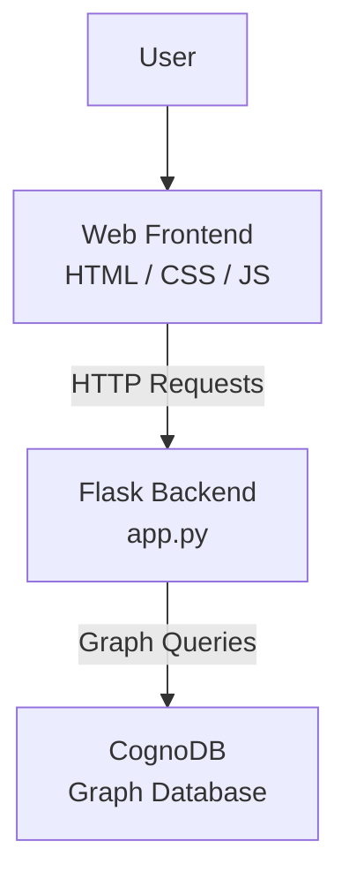
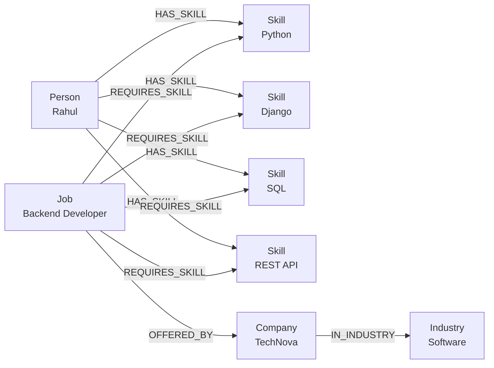

# SkillGraph

SkillGraph is a graph-powered career discovery platform that connects people, skills, jobs, companies, and industries.

The application helps users discover suitable career opportunities based on their existing skills and explore relationships between different career entities.

## Live Application

https://skillgraph-x56l.onrender.com/

## GitHub Repository

https://github.com/944194/SkillGraph

---

## Project Overview

SkillGraph uses a graph database to represent career-related relationships.

The system connects:

Person → Skill → Job → Company → Industry

For example:

Person:
Rahul

Skills:
Python, Django, SQL, REST API

Career opportunities can then be identified based on the skills associated with the person.

---

## Main Features

### 1. Career Matching

Users can select a person and find recommended jobs based on their existing skills.

The system calculates how many required skills for a job are matched.

Example:

- Backend Developer — 100%
- Data Analyst — 100%
- Python Developer — 66.7%

The system also shows skills that the user needs to develop for a particular job.

---

### 2. Career Path Exploration

SkillGraph supports multi-hop graph traversal.

The application can follow a relationship such as:

Person → Skill → Job → Company → Industry

Example:

Rahul → Django → Backend Developer → TechNova → Software

This helps users understand how their skills are connected to possible career opportunities.

---

### 3. Skill Explorer

Users can search for a particular skill such as Python.

The application displays:

- People who have the skill
- Jobs related to the skill
- Companies associated with those jobs
- Related industries

Example:

Python

People:
- Rahul
- Priya
- Arjun
- Sneha

Related opportunities:
- Backend Developer
- Full Stack Developer
- Python Developer
- Data Analyst

---

## Technology Stack

### Backend

- Python
- Flask
- Gunicorn

### Database

- CognoDB
- Neo4j Python Driver

### Frontend

- HTML
- CSS
- JavaScript

### Deployment

- GitHub
- Render

---

## Architecture

The application follows this general architecture:


---

## Graph Data Model

SkillGraph represents career information as connected nodes and relationships in CognoDB.

### Nodes

- **Person** — represents a person/candidate.
- **Skill** — represents a technical skill.
- **Job** — represents a job role.
- **Company** — represents a company offering a job.
- **Industry** — represents the industry in which a company operates.

### Relationships

```text
Person ──HAS_SKILL──> Skill

Job ──REQUIRES_SKILL──> Skill

Job ──OFFERED_BY──> Company

Company ──IN_INDUSTRY──> Industry



## Why a Graph Database?

SkillGraph is built around relationships between people, skills, jobs, companies, and industries. These connections are the core of the application, which makes a graph database a natural fit.

In a relational database, this information would normally be spread across multiple tables such as `People`, `Skills`, `Jobs`, `Companies`, and `Industries`. Finding connected information would require several JOIN operations.

With CognoDB, the relationships are represented directly as graph connections:

```text
Person → Skill → Job → Company → Industry