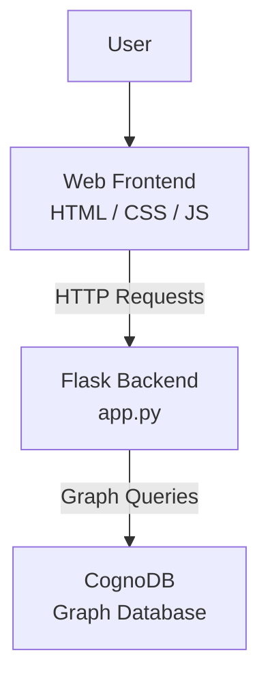
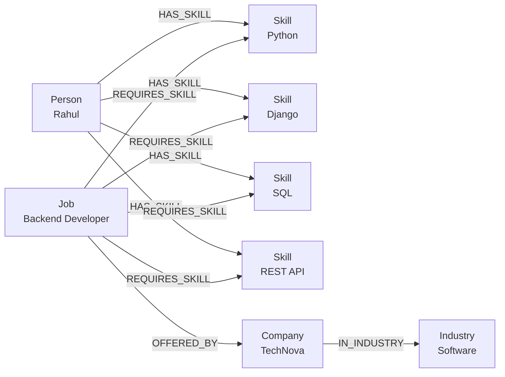
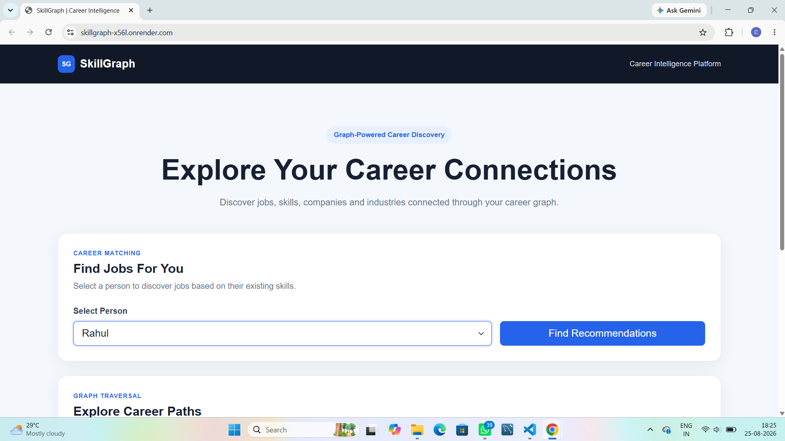
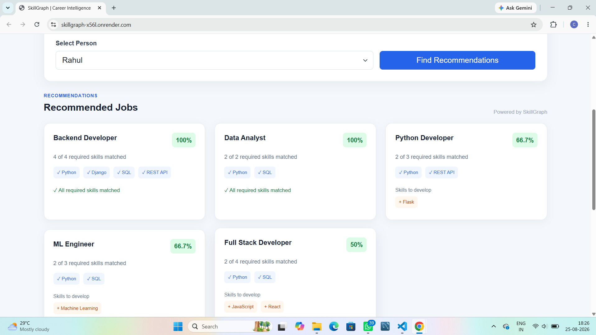
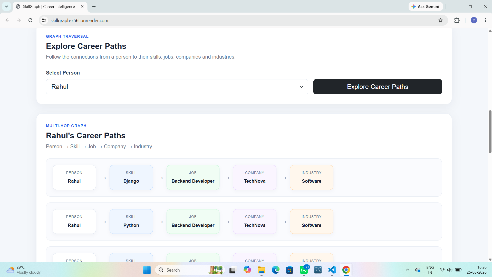
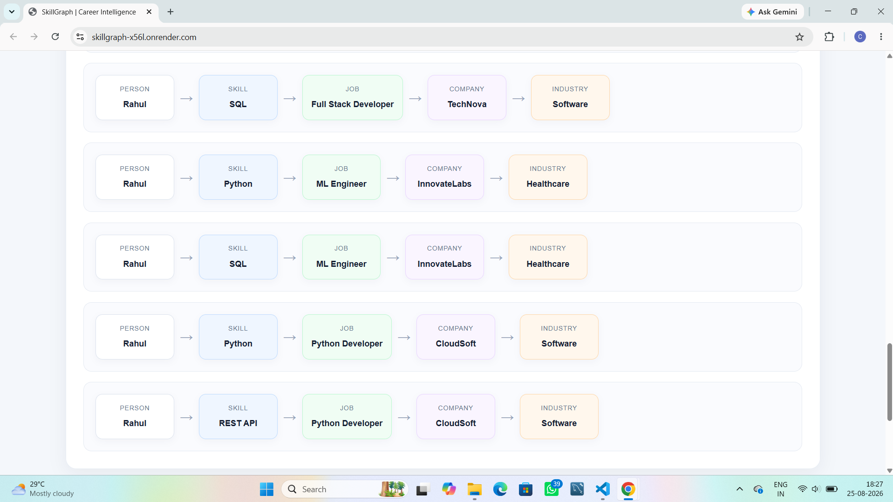
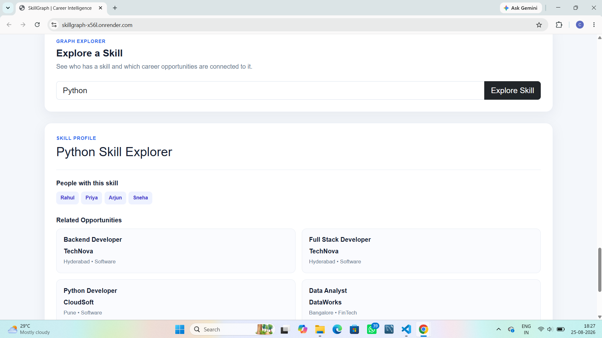
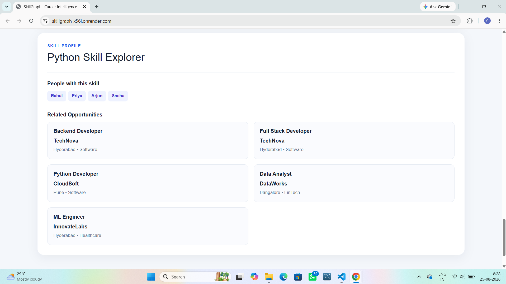

# SkillGraph

SkillGraph is a graph-powered career discovery platform that connects people, skills, jobs, companies, and industries.

The application helps users discover suitable career opportunities based on their existing skills and explore relationships between different career entities.

## Live Application

https://skillgraph-x56l.onrender.com/

## GitHub Repository

https://github.com/944194/SkillGraph

---

## Project Overview

SkillGraph uses a graph database to represent career-related relationships.

The system connects:

Person → Skill → Job → Company → Industry

For example:

Person:
Rahul

Skills:
Python, Django, SQL, REST API

Career opportunities can then be identified based on the skills associated with the person.

---

## Main Features

### 1. Career Matching

Users can select a person and find recommended jobs based on their existing skills.

The system calculates how many required skills for a job are matched.

Example:

- Backend Developer — 100%
- Data Analyst — 100%
- Python Developer — 66.7%

The system also shows skills that the user needs to develop for a particular job.

---

### 2. Career Path Exploration

SkillGraph supports multi-hop graph traversal.

The application can follow a relationship such as:

Person → Skill → Job → Company → Industry

Example:

Rahul → Django → Backend Developer → TechNova → Software

This helps users understand how their skills are connected to possible career opportunities.

---

### 3. Skill Explorer

Users can search for a particular skill such as Python.

The application displays:

- People who have the skill
- Jobs related to the skill
- Companies associated with those jobs
- Related industries

Example:

Python

People:
- Rahul
- Priya
- Arjun
- Sneha

Related opportunities:
- Backend Developer
- Full Stack Developer
- Python Developer
- Data Analyst

---

## Technology Stack

### Backend

- Python
- Flask
- Gunicorn

### Database

- CognoDB
- Neo4j Python Driver

### Frontend

- HTML
- CSS
- JavaScript

### Deployment

- GitHub
- Render

---

## Architecture

The application follows this general architecture:


---

## Graph Data Model

SkillGraph represents career information as connected nodes and relationships in CognoDB.

### Nodes

- **Person** — represents a person/candidate.
- **Skill** — represents a technical skill.
- **Job** — represents a job role.
- **Company** — represents a company offering a job.
- **Industry** — represents the industry in which a company operates.

### Relationships

```text
Person ──HAS_SKILL──> Skill

Job ──REQUIRES_SKILL──> Skill

Job ──OFFERED_BY──> Company

Company ──IN_INDUSTRY──> Industry
```



## Why a Graph Database?

SkillGraph is built around relationships between people, skills, jobs, companies, and industries. These connections are the core of the application, which makes a graph database a natural fit.

In a relational database, this information would normally be spread across multiple tables such as `People`, `Skills`, `Jobs`, `Companies`, and `Industries`. Finding connected information would require several JOIN operations.

With CognoDB, the relationships are represented directly as graph connections:

```text
Person → Skill → Job → Company → Industry
```

---

## Setup and Run

### Prerequisites

- Python 3.x
- Git
- A CognoDB Cloud instance
- Internet connection

### 1. Clone the Repository

```bash
git clone https://github.com/944194/SkillGraph.git
cd SkillGraph
```

### 2. Create a Virtual Environment

Windows PowerShell:

```powershell
python -m venv venv
venv\Scripts\Activate.ps1
```

### 3. Install Dependencies

```powershell
pip install -r requirements.txt
```

### 4. Configure CognoDB

Create a `.env` file in the project root:

```text
COGNODB_URI=your_cognodb_uri
COGNODB_USERNAME=your_cognodb_username
COGNODB_PASSWORD=your_cognodb_password
```

The `.env` file contains sensitive credentials and is excluded from Git using `.gitignore`.

### 5. Load the Seed Data

The project includes a seed script:

```powershell
python scripts/seed_database.py
```

This creates the industries, companies, skills, jobs, people, and graph relationships used by the application.

### 6. Run the Application

```powershell
python app.py
```

The application will be available at:

```text
http://127.0.0.1:5000
```

---

## Main Graph Queries

SkillGraph uses parameterized Cypher queries through the official Neo4j Python driver.

### 1. Find a Person's Skills

The application searches for skills connected to a person through the `HAS_SKILL` relationship.

```cypher
MATCH (p:Person {name: $person_name})-[:HAS_SKILL]->(s:Skill)
RETURN p.name AS person, collect(s.name) AS skills
```

The person name is passed as a parameter rather than being concatenated into the Cypher query.

---

### 2. Find Matching Jobs

The application compares a person's skills with the skills required by available jobs.

```cypher
MATCH (p:Person {name: $person_name})-[:HAS_SKILL]->(s:Skill)
WITH p, collect(s.name) AS person_skills

MATCH (j:Job)-[:REQUIRES_SKILL]->(required:Skill)
WITH p, person_skills, j, collect(required.name) AS required_skills

RETURN j.name AS job,
       person_skills,
       required_skills
```

The backend uses these relationships to calculate:

- Matching skills
- Missing skills
- Match percentage

---

### 3. Multi-Hop Career Path

SkillGraph performs a multi-hop graph traversal from a person to a company and industry.

```cypher
MATCH (p:Person {name: $person_name})
      -[:HAS_SKILL]->(s:Skill)
      <-[:REQUIRES_SKILL]-(j:Job)
      -[:OFFERED_BY]->(c:Company)
      -[:IN_INDUSTRY]->(i:Industry)
RETURN p.name AS person,
       s.name AS skill,
       j.name AS job,
       c.name AS company,
       i.name AS industry
```

This query demonstrates the main advantage of the graph model:

```text
Person → Skill → Job → Company → Industry
```

It allows the application to discover career paths by traversing connected nodes.

---

### 4. Explore a Skill

The Skill Explorer starts from a skill and finds connected people and career opportunities.

```cypher
MATCH (s:Skill {name: $skill_name})
OPTIONAL MATCH (p:Person)-[:HAS_SKILL]->(s)
OPTIONAL MATCH (j:Job)-[:REQUIRES_SKILL]->(s)
OPTIONAL MATCH (j)-[:OFFERED_BY]->(c:Company)
RETURN s.name AS skill,
       collect(DISTINCT p.name) AS people,
       collect(DISTINCT {
           job: j.name,
           company: c.name
       }) AS opportunities
```

This supports questions such as:

- Who has a particular skill?
- Which jobs require that skill?
- Which companies offer those jobs?

---

## UI Screenshots

### SkillGraph Home Page

The home page provides access to the main career discovery features.



### Career Matching

The Career Matching section displays recommended jobs based on a person's existing skills, including match percentages, matching skills, and missing skills.



### Career Path Exploration

The Career Path section demonstrates multi-hop traversal from a person through skills and jobs to companies and industries.





### Skill Explorer

The Skill Explorer displays people and opportunities associated with a selected skill.





---

## Live Demo

The deployed SkillGraph application is available at:

https://skillgraph-x56l.onrender.com/

The hosted application has been tested for:

- Person skill lookup
- Job recommendations
- Career-path traversal
- Skill exploration
- Frontend and backend communication
- CognoDB connectivity